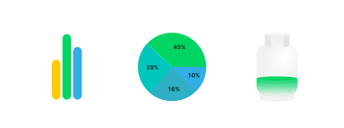

<div align="center">
    
    <h1>Charts for Kotlin Multiplatform projects</h1>
</div>

<div align="center">
Library contains several chart composables for usage in Kotlin Multiplatform projects.   
Currently supported platforms are <strong>Desktop</strong> and <strong>Android</strong>.
</div>

<div align="center">
  <br/><em>Brought with</em> &nbsp;❤️ <em>by</em> &nbsp; <a href="https://www.netguru.com"></a>
</div>

# Installation
### Using local build
Go to `charts` folder and run `assemble[Debug|Release]`. This results in an `aar` file which can then be copied/imported to your project as any other `aar` artifact.
### Using maven dependency
TBA

# Usage
The library provides following components:
 - [BarChart](#BarChart)
 - [BubbleChart](#BubbleChart)
 - [Dial](#Dial)
 - [GasBottle](#GasBottle)
 - [LineChart](#LineChart)
 - [PieChart](#PieChart)

Most of the components have arguments like:
 - **data** - depends on chart type it's complex dataset or few primitives arguments
 - **colors** - gives the possibility to change colors of the chart. In some cases the colors are stored in datasets (like in BarChart or LineChart). See [theming](#Theming) section to set same appearance to all charts.
 - **config** - allows to personalize charts. Depends on chart type it can modify different parts of component. See documentation of specific chart
 - **animation** - the way how chart should appear at the first time

## BarChart


Before using component the BarChartData has to be prepared:
```kotlin
val barChartData = BarChartData(
    categories = listOf(
        BarChartCategory(
            name = "Bar Chart 1",
            entries = listOf(
                BarChartEntry(
                    x = "primary",
                    y = 17f,
                    color = Color.Yellow,
                ),
                BarChartEntry(
                    x = "secondary",
                    y = 30f,
                    color = Color.Red,
                ),
            )
        ),
        BarChartCategory(
            name = "Bar Chart 2",
            entries = listOf(
                BarChartEntry(
                    x = "primary",
                    y = -5f,
                    color = Color.Yellow,
                ),
                BarChartEntry(
                    x = "secondary",
                    y = -24f,
                    color = Color.Red,
                ),
            )
        ),
    )
)
```

```kotlin
BarChart(
    data = barChartData,
    config = BarChartConfig(
        thickness = 14.dp,
        cornerRadius = 7.dp,
    ),
    modifier = Modifier.height(500.dp),
    animation = ChartAnimation.Sequenced(),
)
```

There is another component called `BarChartWithLegend`. It renders bar chart with legend.

## BubbleChart


Before using component the list of Bubble has to be prepared:
```kotlin
val bubbles = listOf(
    Bubble(
        name = "first",
        value = 1.2f,
        icon = Icons.Default.Album,
        color = Color.Yellow
    ),
    Bubble(
        name = "second",
        value = 4.6f,
        icon = Icons.Default.House,
        color = Color.Green
    ),
    Bubble(
        name = "third",
        value = 6.9f,
        icon = Icons.Default.Bed,
        color = Color.Blue
    ),
)
```

```kotlin
BubbleChart(
    bubbles = bubbles,
    modifier = Modifier.size(300.dp),
    animation = ChartAnimation.Sequenced(),
)
```

# Dial


```kotlin
Dial(
    value = 22,
    minValue = -20,
    maxValue = 50,
    modifier = Modifier.fillMaxWidth(),
    animation = ChartAnimation.Simple {
        spring(
            dampingRatio = Spring.DampingRatioMediumBouncy,
            stiffness = Spring.StiffnessLow
        )
    },
    config = DialConfig(
        thickness = 20.dp,
        roundCorners = true,
    ),
    mainLabel = {
        Column(
            horizontalAlignment = Alignment.CenterHorizontally
        ) {
            Text(
                text = "$it°C",
                style = MaterialTheme.typography.h4,
                color = Color.Yellow
            )
            Text(
                text = "outside temperature",
                style = MaterialTheme.typography.body2,
                modifier = Modifier.padding(top = 12.dp)
            )
        }
    }
)
```

There is another component `ProcentageDial`. It accepts only one data argument `percentage` in [0-100] range.


# GasBottle


```kotlin
GasBottle(
    percentage = 75f,
    modifier = Modifier.size(width = 200.dp, height = 300.dp),
    animation = ChartAnimation.Simple {
        spring(
            dampingRatio = Spring.DampingRatioMediumBouncy,
            stiffness = Spring.StiffnessVeryLow
        )
    }
)
```

# LineChart


Before using component the LineChartData has to be prepared:
```kotlin
val lineData = remember {
    LineChartData(
        series = (1..3).map {
            LineChartSeries(
                dataName = "data $it",
                lineColor = listOf(
                    Color.Yellow,
                    Color.Red,
                    Color.Blue,
                )[it - 1],
                listOfPoints = (1..10).map { point ->
                    LineChartPoint(
                        x = DateTime.now().minus(TimeSpan(point * 24 * 60 * 60 * 1000.0)).unixMillisLong,
                        y = (1..15).random().toFloat(),
                    )
                }
            )
        },
    )
}
```

```kotlin
LineChart(
    lineChartData = lineData,
    modifier = Modifier.height(300.dp),
    xAxisLabel = {
        Text(
            fontSize = 12.sp,
            text = DateTime.fromUnix(it as Long).format("yyyy-MM-dd"),
            textAlign = TextAlign.Center
        )
    },
    overlayHeaderLabel = {
        Text(
            text = DateTime.fromUnix(it as Long).format("yyyy-MM-dd"),
            style = MaterialTheme.typography.overline
        )
    },
    animation = ChartAnimation.Sequenced()
)
```


# PieChart


Before using component the list of PieChartData has to be prepared:
```kotlin
val data = listOf(
    PieChartData(
        name = "Data 1",
        value = 10.0,
        color = Color.Yellow,
    ),
    PieChartData(
        name = "Data 2",
        value = 20.0,
        color = Color.Green,
    ),
    PieChartData(
        name = "Data 3",
        value = 30.0,
        color = Color.Blue,
    ),
    PieChartData(
        name = "Data 4",
        value = 40.0,
        color = Color.Red,
    )
)
```
```kotlin
PieChart(
    data = data,
    modifier = Modifier.size(300.dp),
    config = PieChartConfig(
        thickness = 40.dp
    ),
)
```

By default the thickness is `Dp.Infinity`, it means the chart will be fully filled.

# Theming
The easiest way to set the same colors for all charts is to provide `ChartColors` in the app theme.
```kotlin
private val chartColors = ChartColors(
    primary = Color.Green,
    grid = Color.LightGray,
    surface = Color.White,
    fullGasBottle = Color.Green,
    emptyGasBottle = Color.Red,
    overlayLine = Color.Magenta
)

@Composable
fun AppTheme(
    darkTheme: Boolean = isSystemInDarkTheme(),
    content: @Composable () -> Unit,
) {
    CompositionLocalProvider(
        // ...
        LocalChartColors provides chartColors,
    ) {
        MaterialTheme(
            // ...
            content = content,
        )
    }
}

```
There is also default ChartColors provided by the library. It uses the default color set from `MaterialTheme`.
```kotlin
LocalChartColors provides ChartDefaults.chartColors()
```

Each chart has its own color set which can be used like:
```kotlin
BarChart(
    data = barChartData,
    colors = BarChartColors(grid = Color.LightGray)
)
```

Also there is possibility to use ChartColors inside the specific chart:
```kotlin
BarChart(
    data = barChartData,
    colors = ChartColors(...).barChartColors,
)
```

# Security Issues
[Reporting Security Vulnerabilities](SECURITY.md)

# Contributing
[Contributing guidelines](CONTRIBUTING.md)

# License
This library is available as open source under the terms of the [MIT License](https://opensource.org/licenses/MIT).
